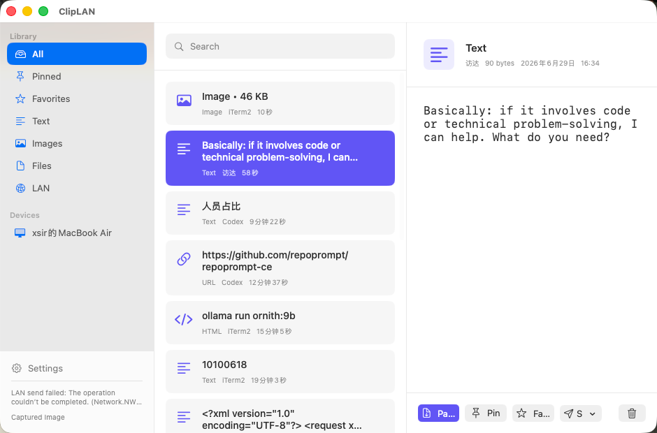
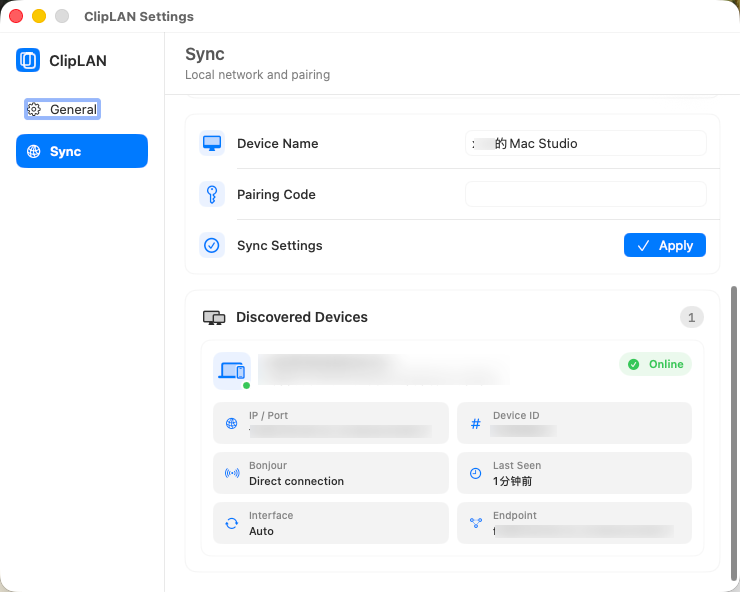

# ClipLAN

ClipLAN is a local-first macOS clipboard history app with fast search, image OCR, auto paste, and LAN sync between Macs.

It is designed for people who want a private clipboard workflow without cloud sync. Clipboard history, payloads, OCR text, and settings stay on the local machine unless LAN sync is enabled.

## Preview

<p align="center">
  
</p>

<p align="center">
  
  
</p>

## Features

- Clipboard history for text, URLs, HTML, RTF, images, and files.
- Search backed by SQLite FTS5.
- Apple Vision OCR for images, indexed locally for search.
- `Shift + Command + V` floating picker with keyboard navigation.
- Optional auto paste through macOS Accessibility permission.
- Menu bar resident app with settings and quick access.
- Bonjour/TCP LAN discovery and sync with a shared pairing code.
- Local payload storage with content-hash deduplication.

## Requirements

- macOS 14 or later.
- Xcode or the Xcode Command Line Tools.
- Accessibility permission is required only for auto paste. Without it, ClipLAN still copies the selected item back to the system pasteboard.

## Build And Run

```bash
./script/build_and_run.sh
```

The script builds the SwiftPM product, stages `dist/ClipLAN.app`, signs it ad-hoc by default, and launches it.

To use a local signing certificate:

```bash
CODE_SIGN_IDENTITY="Developer ID Application: Example" ./script/build_and_run.sh
```

## Package

If SwiftPM is unavailable or you want release artifacts directly, use:

```bash
./script/package.sh all
```

Artifacts are written to `dist/`:

- `ClipLAN.app`
- `ClipLAN.zip`
- `ClipLAN.dmg`
- `ClipLAN.pkg`

You can also build one artifact at a time:

```bash
./script/package.sh app
./script/package.sh zip
./script/package.sh dmg
./script/package.sh pkg
```

## Usage

- `Shift + Command + V`: open the floating picker.
- `Left` / `Right`: move selection in the floating picker.
- `Enter`: copy the selected item and paste it into the previous app when auto paste is allowed.
- `Esc` or outside click: close the floating picker.
- Menu bar icon: open ClipLAN, settings, or quit.

## LAN Sync

LAN sync uses Bonjour service discovery and a JSON-lines TCP protocol.

- Devices must be on the same local network.
- The pairing code must match on both devices.
- Small payloads are sent inline; larger payloads are requested on demand.
- The pairing code is used to keep accidental peers out, but it is not a replacement for end-to-end security on an untrusted network.

## Privacy

ClipLAN does not use cloud services and does not upload clipboard content. See [PRIVACY.md](PRIVACY.md) for details.

## Project Structure

- `Sources/Paste`: macOS SwiftUI/AppKit application shell. The directory name is historical.
- `Sources/PasteCore`: clipboard reading, SQLite storage, payload storage, paste execution, OCR, and LAN sync.
- `Tests/PasteCoreTests`: core storage tests.
- `docs/plans`: design notes.

## Distribution Notes

Unsigned `.pkg` installers are intentionally not the recommended distribution path for open source builds because macOS Installer and Gatekeeper expect a Developer ID Installer certificate. For local testing, prefer `dist/ClipLAN.app`, a zip, or a DMG.

GitHub Actions builds `ClipLAN.dmg`, `ClipLAN.zip`, and `ClipLAN.pkg` on every push to `main`. The files are available from the workflow run artifacts. Pushing a tag such as `v0.1.0` also creates a GitHub Release and uploads the same artifacts.

CI artifacts are unsigned/ad-hoc signed builds. Public binary distribution should use Developer ID signing and notarization.

## License

MIT. See [LICENSE](LICENSE).
